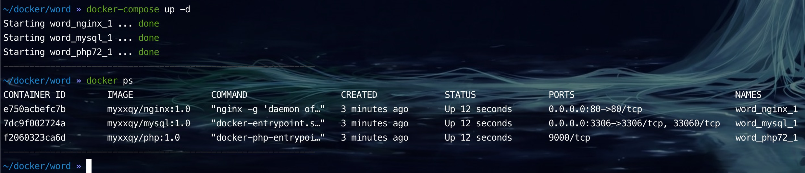
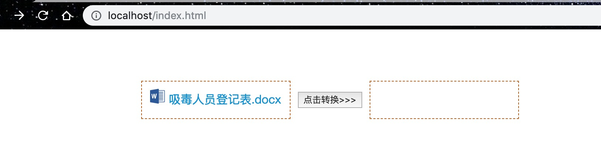
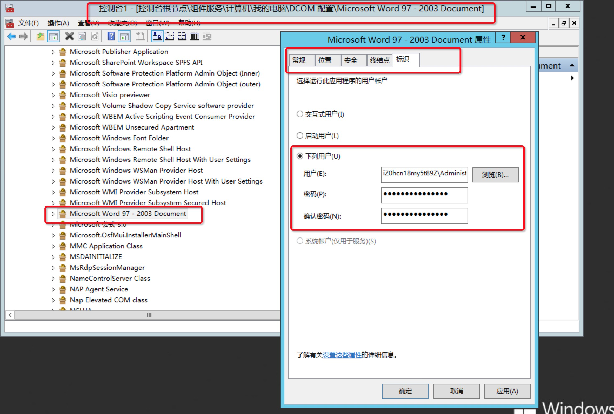

## 组件：word文档转换成pdf

### linux环境下的转换   

#### 1.安装环境   

当前，我们采用`docker`技术，创建一个`container`来模拟服务器(linux + nginx + mysql + php)环境，
具体配置情况我已经把他打包成镜像包，大家可以随意使用，镜像名称在下面的`docker-compose.yml`文件中，
流程步骤如下：   
- 创建`docker-compose.yml`文件，写入以下配置内容：
```yml
version: "3"
services:
  nginx:
    image: myxxqy/nginx:1.0
    ports:
      - "${NGINX_HTTP_HOST_PORT}:80"
    volumes:
      - ${SOURCE_DIR}:/var/wwwroot/:rw
      - ${NGINX_CONFD_DIR}:/etc/nginx/conf.d/:rw
      - ${NGINX_CONF_FILE}:/etc/nginx/nginx.conf:ro
      - ${NGINX_LOG_DIR}:/var/log/nginx/:rw
    restart: always
    networks:
      - default
  php72:
    image: myxxqy/php:1.0
    volumes:
      - ${SOURCE_DIR}:/var/wwwroot/:rw
      - ${PHP72_PHP_CONF_FILE}:/usr/local/etc/php/php.ini:ro
      - ${PHP72_FPM_CONF_FILE}:/usr/local/etc/php-fpm.d/www.conf:rw
      - $PWD/fonts/:/usr/share/fonts
    restart: always
    cap_add:
      - SYS_PTRACE
    networks:
      - default
  mysql:
    image: myxxqy/mysql:1.0
    ports:
      - "${MYSQL_HOST_PORT}:3306"
    volumes:
      - ${MYSQL_CONF_FILE}:/etc/mysql/conf.d/mysql.cnf:ro
      - ${MYSQL_DATA_DIR}:/var/lib/mysql/:rw
    restart: always
    networks:
      - default
    environment:
      MYSQL_ROOT_PASSWORD: "${MYSQL_ROOT_PASSWORD}"
networks:
  default:

```    
- 打开命令行，进入到当前目录，执行`docker-composer up -d`        
 
- 服务启动成功，打开浏览器输入`localhost/index.html`进入demo页面    
如图所示：        


### 2.操作说明

在linux环境下转换word文件采用的是开源软件`libreOffice`和小工具`unoconv`来实现的，主要的命令如下：
```
unoconv -f pdf -o your_pdf_path  your_word_path
```
至于中文乱码问题，这里把**windows系统字体文件夹里所有的文件**全部放在`fonts`文件夹里面，挂载到环境的`/usr/share/fonts`目录里即可自动转换。   
-- （*注意）这里fonts文件夹占用空间太大，请自行寻找fonts资源，放进去。

## windows环境下的转换

### 1.环境安装
目前采用的是`windows server 2012R2` 的服务器，采用的是`apache` + `php` + `mysql`的环境,
具体配置过程这里就不介绍了，这里讲下开启php的`dcom`扩展：
- 打开php配置文件`php.ini`，搜索`php_com_dotnet`
- 找到`extension=php_com_dotnet.dll`，把前面的分号去掉
- 找到`com.allow_dcom = true`，把等号后面的值改成`true`
- 最后重启`apache`服务 

### 2.服务器上安装office
因为项目中需要使用`PHPOffice/PHPWord`把文档中的变量转成需要的值，而这个库只支持`docx`，
所以`word`的版本不能低于`word2007`,具体安装和激活`office`的过程这里我就不多说了，自己百度或google去。

### 3.服务器开启组件服务权限
具体转换的代码如下:
```php
$word = new \COM("Word.Application") or die ("Could not initialise Object.");
$word->Documents->Open($this->createFile);
$word->ActiveDocument->ExportAsFixedFormat($this->createPdfFile, 17, false, 1, 0, 0, 0, 0, false, false, 0, false, false, false);
$word->Quit(false);
```
如果没有开启组件服务权限的话，使用COM扩展的话会报类似下面这样的错误：
```
Can't open Word doc with COM in PHP
```
这样我们需要开启组件服务相关的权限：    
- 按`ctrl + R`打开运行。
- 输入`mmc -32`，然后回车，打开控制台1。
- 点击文件-`添加或删除管理单元`，然后在左侧找到`组件服务`，点击`添加`，然后点击确定。
- 然后在控制台1的界面就会看到控制台根节点下面有了`组件服务`，然后依次点击`计算机`-`我的电脑`-`DCOM配置`。
- 在里面找到`Microsoft Office Word 97-2003`，这里才是重点，右键`属性`。
- 在`常规`的身份验证级别里面选择`无`，然后在`位置`属性里面选择`在数据所在的计算机运行应用程序(D)`。
- 在`安全`里面，把`启动和激活权限`、`访问权限`和`配置权限`都设置成自定义，在里面都添加`Everyone`用户，权限都勾上。
- 在`标识`属性里面（注意，这里最重要！！）选择`下列`用户，把远程登录的账户和密码写进去，然后点击`应用`和`确定`，如图：   

然后运用业务代码，你会发现php的代码调用了系统组件服务的功能，打开了word文档，然后调用了微软的word文档相关接口进行另存为pdf。